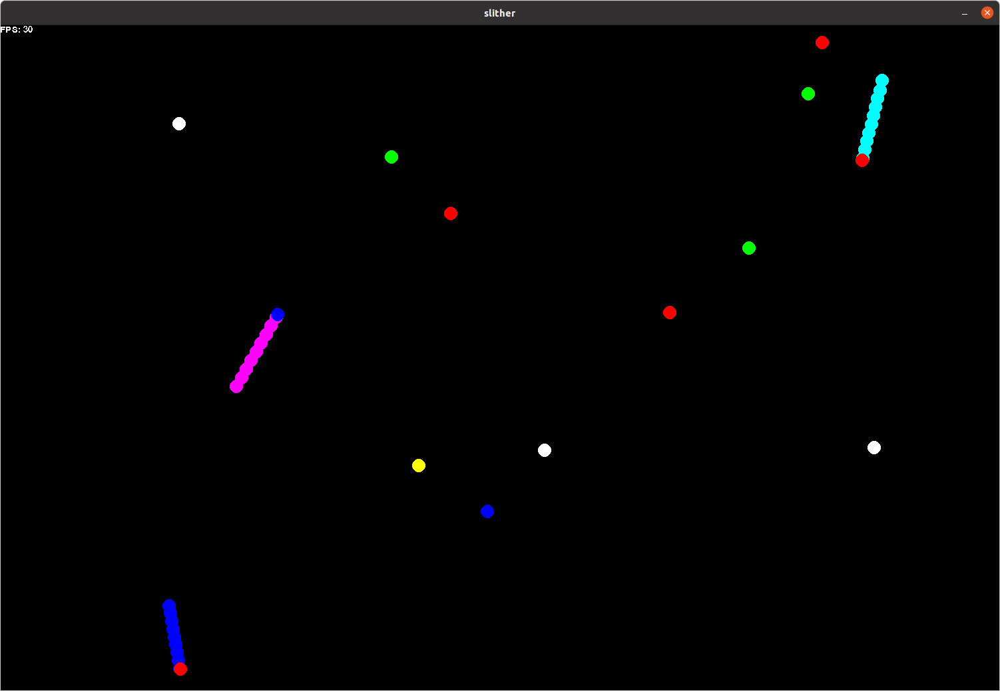
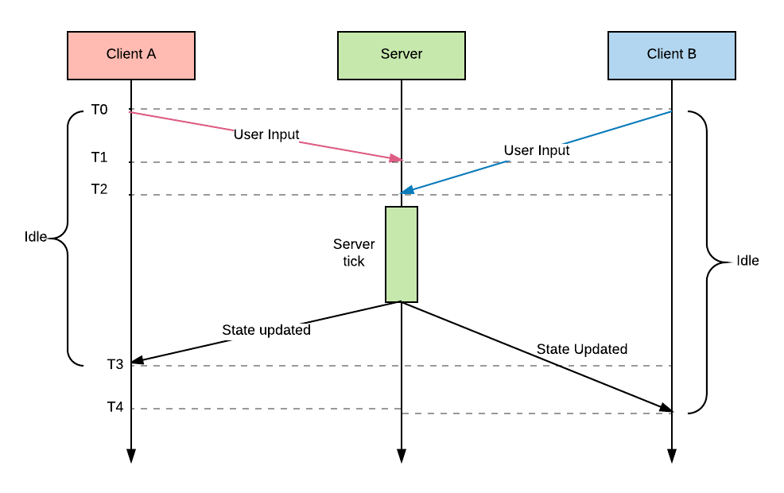

# Slither

## About the game

Das ist ein Multiplayer Netzwerk Spiel bei den man einen Wurm steuert. Der Wurm kann sich in allen Richtungen (360 Grad) bewegen.
Der eigene Wurm ist durch einen blauen Kopf gekennzeichnet.
Durch Items kann er seine Größe und Geschwindigkeit verändern.
Das Spielfeld hat keine echten Grenzen. Wenn sich ein Wurm auf eine Grenze zubewegt, erscheint er auf der anderen Seite des Spielfeldes.
Man stirbt, wenn man mit dem Kopf des Wurmes in einen anderen Wurm hineinfährt.
Das Ziel ist also möglichst lange zu überleben, möglichst viele zu töten und maximal zu wachsen.

Der Fokus ist Hauptsächlich auf den Multiplayer Modus gelegt. 
Über ein IP-Netzwerk können sich Spieler auf einen Server verbinden und gegeneinander spielen.

## Steuerung

Es gibt nur zwei relevante Tasten. 

`A`: Drehung des Kopfes gegen den Uhrzeigersinn

`D`: Drehung des Kopfes im Uhrzeigersinn

Um das Spiel zu beenden einfach das Fenster schliesen.

## Verwendete Python Module

### Externe Module, installiert mit `pip3`
* `pygame`, Modul zur Spieleprogrammierung
* `autobahn`.websocket, Websocket Modul für den Multiplayer
* `cbor`, binäres kompaktes Datenformat zur Serialisierung

### Direkt aus Python verwendete Module
* `math`, für Berechnungen
* `asyncio`, required by autobahn
* `random`, für einen Zufallsfaktor im Spiel
* `enum`, um Enums nutzen zu können
* `sys`, um das Spiel zu beenden und um auf Start Parameter zugreifen zu können
* `subprocess`, um den Server im Hintergrund zu starten
* `time`, um das Spiel zu Pausieren

## Verwendete Klassen

Das Spiel ist objektorientiert programmiert. Folgende Klassen wurden erstellt:

* #### Circle
    * Alles was gezeichnet wird ist in diesem Spiel ein Kreis.
    * Ein Objekt der Klasse kann sich selbst zeichen, bewegen und Kollisionen mit anderen Circle-Objekten erkennen.
* #### Food
    * Erbt von `Circle`.
    * Objekte bewegen sich zufällig im Spielfeld.
    * Lässt sich für den WebSocket in ein `dict` exportieren und importieren.
    * Bei jeden Food wächst der Wurm um die Größe `Food.energy`.
    * Hat eine Eigenschaft von Typ `FoodType`.
* #### FoodType
    * Definiert die Art, Farbe und Effekte eines `Food`-Objekts.
    * Typen:
        * Nothing: Farbe Weis
        * Faster: Farbe Rot, Wurm wird schneller
        * Slower: Farbe Blau, Wurm wird langsamer
        * Bigger: Farbe Grün, Wurm wird größer (Radius der `Circle`-Objekte wird größer)
        * Smaller: Farbe Gelb, Wurm wird kleiner (Radius der `Circle`-Objekte wird kleiner)
* #### Worm
    * Besteht aus vielen `Circle`-Objekten gespeichert in `Worm.body`.
    * Lässt sich für den WebSocket in ein `dict` exportieren und importieren.
* #### MesType
    * Enum.
    * Enthält die Nachrichten Typen für `Message`.
* #### Message
    * Nachricht zwischen.
    * Wird serialisiert und per WebSocket übertragen.
* #### Game
    * Kümmert sich um die richtige Ausführung und Reihenfolge der Nachrichten Sendungen, Berechnung und Zeichnung.
* #### Client
    * Startet das `SlitherClient` Protokoll.
    * Verbindet sich mit dem Server.
    * IP-Adresse und Port des Servers lässt sich anpassen.
* #### SlitherClient
    * Erbt von `WebSocketClientProtocol` von Modul autobahn.
    * Kümmert sich um das Erhalten und senden von Nachrichten.
    * Aktualisiert die zu zeichnenden Objekte und sendet den Benutzer Input.
* #### SlitherServer
    * Erbt von `WebSocketServerProtocol` von Modul autobahn.
    * Die Server Logik.
    * Kümmert sich um den Verbindungsaufbau und Abbau, senden und empfangen von Nachrichten.
    * Empfängt den Input aller Clients an, berechnet die Positionen und sendet die Positionen an die Clients.
* #### ConnectedClients
    * `SlitherServer` besitzt eine Liste mit Objekten dieser Klasse.
    * Enthält Informationen über einen Verbundenen Client.
    
## Konfiguration
Das Spiel lässt sich über die `settings.py` konfigurieren. 
Wird debug auf True gesetzt, läuft das Spiel deutlich langsamer und mehr debug Meldungen werden auf stdout geschrieben. 
**Die Konfiguration sollte auf Client und Server identisch sein!**

## Installation:
Ich habe dieses Spiel mit Python 3.8 entwickelt. 

Das Spiel benötigt ein paar Module welche geladen werden müssen.
Wenn `pipenv` installiert ist, kann einfach folgendes innerhalb des Ordners ausführen:

```shell
pipenv install
```

ODER, manuelle installation:

```shell
pip install pygame
pip install autobahn
pip install cbor
```

## Spiel Starten

### Multiplayer

#### Server:

```shell
python3 start_server.py 
```

Standardmäßig läuft der Server auf Port 9000. Um den Port beispielsweise auf 9001 zu legen:
```shell
python3 start_server.py 90001
```
Der gewählte Port muss natürlich frei sein.
Wenn der Server gestartet werden kann, gibt er seine IP-Adresse und Port auf stdout aus.

#### Client:

Der Client wird mit dem start_client.py gestartet. 
Der erste Parameter ist die IP-Adresse des Servers, der zweite die Port Nummer. 
Die Standardwerte sind 127.0.0.1 9000.

```shell
python3 start_client.py 192.168.12.9 9000
```

### Singleplayer

Im Singleplayer Modus wird der Server auf dem Localhost gestartet und auf Port 9000 gehört. 
Der Client verbindet sich mit dem Server.

Starten des Singleplayer Modus:

```shell
python3 start_singleplayer.py
```

## Das Client-Server-Modell
Diese Architektur wurde gewählt, weil sie am **schnellsten und einfachsten zu implementieren ist.** 
Sie hat aber auch die meisten schwächen. 
Das größte Problem ist hier, das der langsamste Client alle anderen Clients auf das gleiche Niveau hinunter zieht.
In einer neueren Version würde ich dieses Modell ändern, wahrscheinlich auf ein 'Prediction and Rollback' Konzept.




#### Aufgaben des Servers:
* Clients registrieren und annehmen/ablehnen
* Empfangen der Inputs der Clients
* Kalkulation der Bewegungen und Kollisionen
* Update der Positionen und co den Clients senden

#### Aufgaben der Clients:
* Verbindung mit Server aufbauen
* Senden der Benutzer eingaben
* Empfangen der neuen Positionen
* Teilweise selbständige Berechnung der Bewegungen
* Zeichnen der Objekte
``